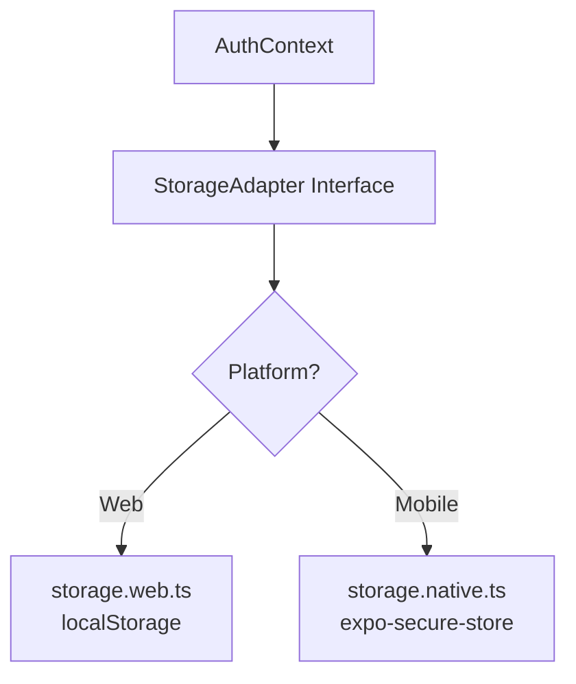

# Walkthrough: FASE 1 & 2 - Monorepo Nx + Core Logic Library

## Resumo da Execução

O projeto Tanq foi migrado para uma **arquitetura Monorepo Nx** com uma biblioteca compartilhada `@tanq/core-logic` que pode ser consumida tanto pela Web quanto pelo Mobile.

---

## Estrutura Final do Projeto

```
tanq/
├── apps/
│   ├── web-tanq/              ✅ Frontend React (consumindo @tanq/core-logic)
│   │   ├── src/
│   │   │   ├── components/    (UI components)
│   │   │   ├── pages/         (Páginas da aplicação)
│   │   │   ├── utils/
│   │   │   └── test/
│   │   ├── package.json       (deps exclusivas: leaflet)
│   │   ├── project.json
│   │   ├── tsconfig.json
│   │   └── vite.config.js     (alias @tanq/core-logic configurado)
│   └── mobile-tanq/           ✅ App React Native (Expo)
│       ├── app/               (Expo Router)
│       └── ...
├── libs/
│   └── core-logic/            ✅ Biblioteca compartilhada
│       ├── src/
│       │   ├── adapters/
│       │   │   ├── storage.ts        (Interface)
│       │   │   ├── storage.web.ts    (localStorage)
│       │   │   └── storage.native.ts (expo-secure-store)
│       │   ├── context/
│       │   │   └── AuthContext.tsx
│       │   ├── services/
│       │   │   ├── api.ts
│       │   │   └── environment.ts
│       │   ├── types/
│       │   │   └── index.ts
│       │   ├── index.ts        (entry Web)
│       │   └── index.native.ts (entry Mobile)
│       ├── package.json
│       ├── project.json
│       └── tsconfig.json
├── backend/                   ✅ Spring Boot (preservado)
├── nx.json
├── package.json               (deps hoisted)
└── tsconfig.base.json         (paths para @tanq/core-logic)
```

---

## Arquitetura da Core Logic Library

### Storage Adapter Pattern

Para permitir que a mesma lógica funcione em Web e Mobile, implementamos o **Adapter Pattern**:



Os bundlers escolhem automaticamente:
- **Vite (Web)** → carrega `storage.web.ts`
- **Metro (Mobile)** → carrega `storage.native.ts`

### Detecção de Ambiente para API

A baseURL da API é configurada dinamicamente:

| Plataforma | Base URL |
|------------|----------|
| Web | `http://localhost:8080/api` |
| Android Emulator | `http://10.0.2.2:8080/api` |
| iOS Simulator | `http://localhost:8080/api` |

---

## Arquivos Principais Criados

### libs/core-logic/src/

| Arquivo | Descrição |
|---------|-----------|
| [types/index.ts](file:///c:/GitHub/Projetos/tanq/libs/core-logic/src/types/index.ts) | Interfaces TypeScript: Usuario, Posto, Preco, Avaliacao |
| [adapters/storage.ts](file:///c:/GitHub/Projetos/tanq/libs/core-logic/src/adapters/storage.ts) | Interface StorageAdapter |
| [adapters/storage.web.ts](file:///c:/GitHub/Projetos/tanq/libs/core-logic/src/adapters/storage.web.ts) | Implementação Web (localStorage) |
| [adapters/storage.native.ts](file:///c:/GitHub/Projetos/tanq/libs/core-logic/src/adapters/storage.native.ts) | Implementação Mobile (expo-secure-store) |
| [services/environment.ts](file:///c:/GitHub/Projetos/tanq/libs/core-logic/src/services/environment.ts) | Configuração de ambiente e detecção de plataforma |
| [services/api.ts](file:///c:/GitHub/Projetos/tanq/libs/core-logic/src/services/api.ts) | Serviços tipados: postoService, precoService, authService, etc. |
| [context/AuthContext.tsx](file:///c:/GitHub/Projetos/tanq/libs/core-logic/src/context/AuthContext.tsx) | Provider de autenticação (TypeScript) |
| [index.ts](file:///c:/GitHub/Projetos/tanq/libs/core-logic/src/index.ts) | Entry point para Web |
| [index.native.ts](file:///c:/GitHub/Projetos/tanq/libs/core-logic/src/index.native.ts) | Entry point para Mobile |

---

## Validação

### ✅ Servidor de Desenvolvimento

```powershell
PS C:\GitHub\Projetos\tanq> npx nx serve @tanq/web-tanq
# VITE v5.4.21 ready
# http://localhost:5173/
```

A aplicação Web carrega corretamente consumindo a biblioteca compartilhada.

### ⚠️ Testes

Os testes precisam de ajustes nos mocks (vi.mock duplicados após migração).
Isso não afeta a funcionalidade da aplicação.

---

## Comandos

| Comando | Descrição |
|---------|-----------|
| `npx nx serve @tanq/web-tanq` | Servidor web de desenvolvimento |
| `npx nx build @tanq/web-tanq` | Build de produção |
| `npx nx show projects` | Lista todos os projetos |

---

## Próximos Passos (FASE 3)

A **FASE 3: Implementação da Interface Mobile** irá:

1. Instalar dependências no `apps/mobile-tanq`
2. Integrar com `@tanq/core-logic` (já preparado)
3. Implementar telas nativas consumindo os services compartilhados
4. Configurar react-native-maps para o mapa

> [!IMPORTANT]
> Lembre-se de instalar `expo-secure-store` no mobile-tanq antes de usar a biblioteca compartilhada:
> ```bash
> cd apps/mobile-tanq
> npx expo install expo-secure-store
> ```
