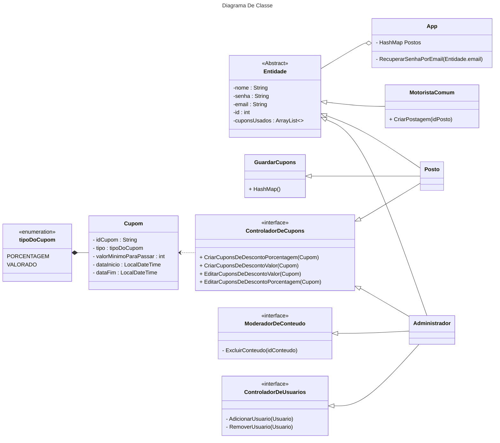

# Documento de Arquitetura de Software - Projeto Tanq

## 1. Diagramas do Sistema

Esta seção apresenta a representação visual da arquitetura e da modelagem de dados do sistema.

### 1.1. Diagrama de Arquitetura (Componentes)
O diagrama abaixo ilustra a organização dos componentes de tela, controladores e interfaces de comunicação.

### 1.2. Diagrama de Classes (Domínio)
O diagrama abaixo detalha as entidades, enums e interfaces que compõem a lógica de negócio e segurança do sistema.

## 2. Descrição da Arquitetura Adotada

O sistema **Tanq** utiliza uma arquitetura **Cliente-Servidor** estruturada em camadas (Layered Architecture), adotando o padrão de projeto **MVC (Model-View-Controller)** para a organização do backend e separação de responsabilidades. A comunicação entre a interface do usuário e o servidor é realizada através de uma **API RESTful**.

A arquitetura é dividida nas seguintes camadas lógicas:

* **Camada de Apresentação (Frontend/View):**
    * Representada pelos componentes de "Screen" (ex: `MapaPostosScreen`, `CupomScreen`).
    * Responsável pela interação direta com o usuário (Motorista, Dono de Posto ou Administrador).
    * Não possui lógica de negócio complexa; ela consome serviços através de interfaces HTTP.

* **Camada de Serviço/Controladores (Backend/Controller):**
    * Representada pelos "Controllers" (ex: `PostoController`, `CupomController`).
    * Atua como o ponto de entrada da API. Recebe as requisições REST (ex: `/postos`, `/cupons`), processa as regras de negócio e decide qual resposta enviar.
    * Implementa as interfaces de controle definidas no diagrama de classes (ex: `ControladorDeCupons`, `ControladorDeUsuarios`), garantindo que apenas atores autorizados executem certas ações.

* **Camada de Modelo e Domínio (Model):**
    * Contém a estrutura de dados e as regras fundamentais do negócio, conforme definido no Diagrama de Classes.
    * Utiliza herança e polimorfismo, onde a classe abstrata `Entidade` serve de base para `MotoristaComum`, `Posto` e `Administrador`, centralizando atributos comuns como autenticação e identificação.

* **Camada de Persistência (Data):**
    * Responsável pelo armazenamento e recuperação de dados.
    * Utiliza uma conexão SQL para interagir com o `Database`.

## 3. Tecnologias e Frameworks

Com base nos diagramas e requisitos do sistema, as tecnologias definidas são:

* **Linguagem de Backend:** **Java** (Inferido pela estrutura de classes, uso de tipagem forte e interfaces).
* **Banco de Dados:** **SQL** (Provavelmente MySQL ou PostgreSQL, para suportar o relacionamento entre Entidades e Cupons).
* **Comunicação:** **REST API** (Protocolo HTTP/HTTPS para troca de mensagens JSON entre as telas e os controladores).
* **Modelagem de Dados:** **UML** (Para documentação de classes e componentes).
* **Frontend (Mobile/App):** *[A definir: React Native / Flutter / Java Android]* (Responsável por renderizar as Views listadas como `Screen`).

## 4. Justificativas das Escolhas e Relação com os Objetivos

As escolhas arquiteturais visam atender aos objetivos do Tanq de ser uma plataforma colaborativa, segura e escalável para monitoramento de preços de combustíveis.

### 4.1. Uso de Arquitetura Baseada em API REST
* **Justificativa:** O diagrama de componentes mostra endpoints claros (`/ranking`, `/chatbot`). Essa separação permite que o backend (Java) evolua independentemente do frontend (App Mobile).
* **Objetivo:** Permite que, no futuro, o sistema possa ter uma versão Web ou iOS sem precisar reescrever a lógica de negócio, apenas consumindo a mesma API.

### 4.2. Estrutura de Classes com Herança e Interfaces
* **Justificativa:** A criação da classe abstrata `Entidade` evita duplicação de código para atributos comuns (login, senha). O uso de interfaces (`ControladorDeCupons`, `ModeradorDeConteudo`) implementa o princípio de **Segregação de Interfaces**.
* **Objetivo:** Segurança e Controle de Acesso (RBAC). O diagrama garante, via código, que um `MotoristaComum` não consiga métodos de `Moderador`, pois sua classe não implementa a interface correspondente.

### 4.3. Banco de Dados SQL
* **Justificativa:** O sistema lida com dados estruturados e relacionais (ex: Um `Posto` possui muitos `Cupons`; Um `Cupom` tem um `tipoDoCupom`).
* **Objetivo:** Garantir a integridade dos dados (ACID), essencial para transações financeiras ou de validação de cupons (Enum `VALORADO` vs `PORCENTAGEM`).

### 4.4. Componentização das Telas (Screens)
* **Justificativa:** O diagrama de arquitetura separa funcionalidades distintas (`Ranking`, `Chatbot`, `Login`) em componentes isolados.
* **Objetivo:** Manutenibilidade. Se o módulo de Chatbot apresentar falha, ele não compromete o funcionamento do módulo de Mapa ou Login.